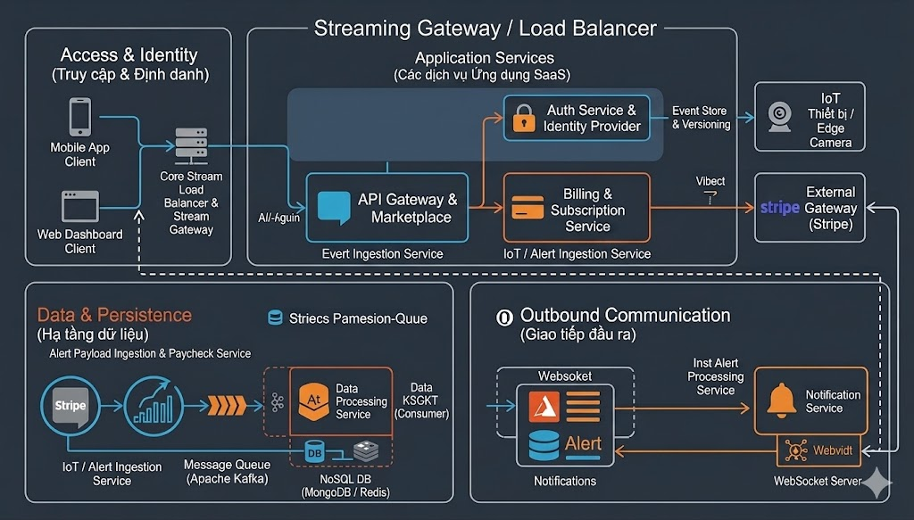

# 🛡️ Nền tảng SaaS Quản lý Cảnh báo IoT & Thuê bao Dịch vụ

> Hệ thống Backend hiệu năng cao, điều hướng theo sự kiện (event-driven) để quản lý thiết bị IoT, xử lý cảnh báo thời gian thực và tự động hóa thanh toán gói cước.

## 📖 Tổng quan
Dự án này mô phỏng hệ thống backend cốt lõi cho một nền tảng SaaS Giám sát An ninh IoT. Hệ thống cho phép người dùng đăng ký các gói dịch vụ cao cấp, đăng ký thiết bị Edge AI (camera/gateway) của họ và nhận các cảnh báo bảo mật theo thời gian thực. 

Kiến trúc được thiết kế để xử lý luồng tiếp nhận sự kiện với thông lượng cao (high-throughput) sử dụng **Kafka**, đồng thời đảm bảo tính toàn vẹn dữ liệu trong quá trình thanh toán bằng việc áp dụng nguyên tắc **Idempotency** (chống trùng lặp).

## 🚀 Tính năng chính & Điểm nhấn Công nghệ

*   **Kiến trúc hướng Microservices:** Hệ thống được phân tách logic thành các domain độc lập (Xác thực, Thanh toán, Tiếp nhận dữ liệu, Phân phối cảnh báo).
*   **Tiếp nhận dữ liệu hiệu năng cao:** Sử dụng **Apache Kafka** làm message broker để hứng lượng lớn payload cảnh báo gửi lên đồng thời từ các thiết bị Edge mà không làm quá tải database.
*   **Xử lý Thanh toán & Webhook:** Tích hợp **Stripe API** để quản lý gói cước (subscription). Áp dụng chặt chẽ Idempotency Key để ngăn chặn việc trừ tiền hai lần hoặc sai lệch dữ liệu khi mạng gặp sự cố phải gửi lại (retry).
*   **Phân phối cảnh báo thời gian thực:** Ứng dụng **Redis** để cache dữ liệu nóng (newsfeed) và **WebSocket** để đẩy thông báo ngay lập tức đến ứng dụng của người dùng cuối.
*   **Bảo mật:** Kiểm soát truy cập dựa trên vai trò (RBAC) và xác thực phi trạng thái (stateless) bằng **JWT** thông qua Spring Security.

## 🏗️ Kiến trúc Hệ thống

*(Bạn hãy vẽ 1 sơ đồ kiến trúc bằng draw.io hoặc excalidraw và chèn link ảnh vào đây)*


### Các Module Cốt lõi:
1.  **Module Định danh & Truy cập (Identity & Access):** Xử lý đăng ký người dùng, khởi tạo token JWT và phân quyền RBAC.
2.  **Module Thanh toán & Cấp phép (Billing & Provisioning):** Quản lý thông tin khách hàng trên Stripe, lắng nghe webhook và kiểm soát giới hạn số lượng thiết bị được phép hoạt động dựa trên gói cước.
3.  **Service Tiếp nhận Sự kiện (Event Ingestion):** Một API gọn nhẹ giao tiếp trực tiếp với thiết bị Edge, làm nhiệm vụ xác thực API key và đẩy thẳng payload JSON nhận được vào các topic của Kafka.
4.  **Service Xử lý Cảnh báo & Newsfeed (Alert Processing & Feed):** Đóng vai trò là Kafka consumer để xử lý các sự kiện thô, cập nhật Redis cache để truy xuất nhanh và lưu trữ dữ liệu vĩnh viễn xuống database quan hệ.

## 💻 Công nghệ Sử dụng (Tech Stack)

*   **Ngôn ngữ:** Java 17+
*   **Framework:** Spring Boot 3.x (Spring Web, Spring Data JPA, Spring Security)
*   **Database:** MySQL / PostgreSQL (Cơ sở dữ liệu quan hệ)
*   **Caching:** Redis (Newsfeed & Quản lý Session)
*   **Message Broker:** Apache Kafka (Xử lý luồng sự kiện)
*   **Cổng thanh toán:** Stripe Java SDK
*   **Công cụ Build:** Maven / Gradle
*   **Container hóa:** Docker & Docker Compose

## 🛠️ Hướng dẫn Cài đặt Môi trường Local

### Yêu cầu hệ thống (Prerequisites)
*   JDK 17 trở lên
*   Docker & Docker Compose (để chạy DB, Redis, và Kafka)
*   Tài khoản Stripe (để lấy API key)

### Bước 1: Khởi động các Service Hạ tầng
Chạy lệnh Docker Compose dưới đây để khởi tạo MySQL, Redis và cụm Kafka:
```bash
docker-compose up -d